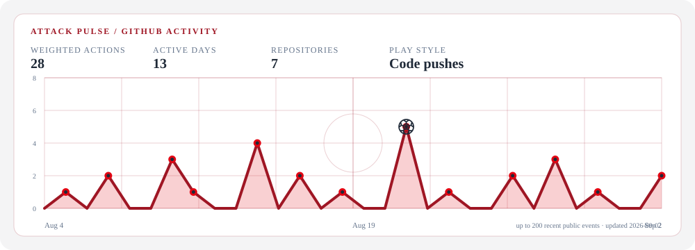
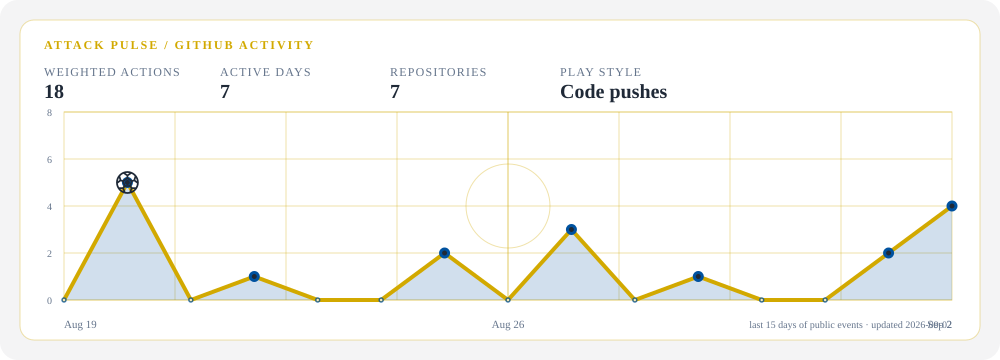
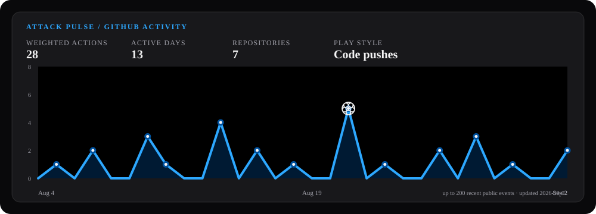
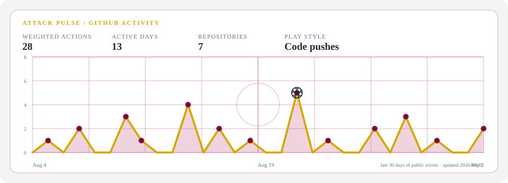
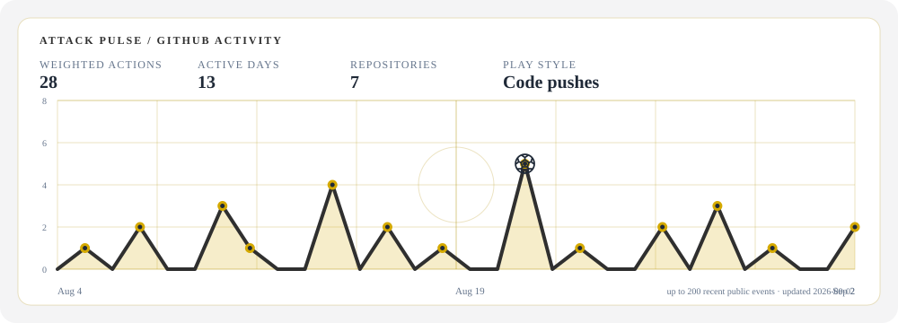
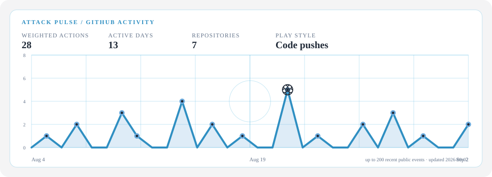

# GitHub Readme Attack Pulse

An embeddable soccer activity graph for GitHub profile READMEs. It turns the public events behind a profile into a 30-day attack pulse, then marks the day where that profile played its most active stretch.

## The useful part is the habit read

This is not another contribution-calendar clone. The Worker reads up to 200 recent public events and computes the same compact scouting report for every render:

| Signal | What it tells you |
| --- | --- |
| Weighted actions | How intense the recent activity was, with pushes, reviews, issues, releases, and other events weighted by action value. |
| Active days | Whether the work happened consistently or in short bursts. |
| Repositories | How many distinct codebases appeared in the recent run. |
| Play style | The dominant event type, such as code pushes or pull requests. |
| Daily pulse and peak | The rhythm of the last 30 days, with the highest-activity day marked by a football. |

The result is a static SVG, so the analysis remains readable when GitHub or a README viewer does not run JavaScript.

## Embed

```html

```

Live endpoint: <https://github-readme-attack-pulse.github-readme-attack-pulse.workers.dev/graph?username=AlexBybye&club=bayern>

`username` is required. `club` is optional and accepts `bayern`, `realmadrid`, `intermilan`, `barcelona`, `dortmund`, or `mancity`; unknown values fall back to `bayern`. `manchestercity` is also accepted as an alias for `mancity`. These are club-inspired palette names only and do not include official club logos or assets.

## Palette previews

Every preset uses the same chart layout, spacing, typography, and peak marker. A shared soft-gray background keeps the card integrated with GitHub, while the pitch grid and pulse use each club's accent colors.

<table>
  <tr>
    <td><strong>Bayern</strong><br></td>
    <td><strong>Real Madrid</strong><br></td>
  </tr>
  <tr>
    <td><strong>Inter Milan</strong><br></td>
    <td><strong>Barcelona</strong><br></td>
  </tr>
  <tr>
    <td><strong>Dortmund</strong><br></td>
    <td><strong>Manchester City</strong><br></td>
  </tr>
</table>

The preview files use a fixed sample event shape so the five palettes can be compared side by side. The hosted endpoint always computes the chart from the requested user's current public events.

## Local development

```bash
npm install
npm test
npm run typecheck
npm run dev
```

For production, create a Cloudflare KV namespace, bind it as `ATTACK_PULSE_CACHE` in `wrangler.toml`, and set `GITHUB_PUBLIC_TOKEN` with `wrangler secret put GITHUB_PUBLIC_TOKEN`. A token increases GitHub API headroom; it is never returned to clients.

## License

MIT
